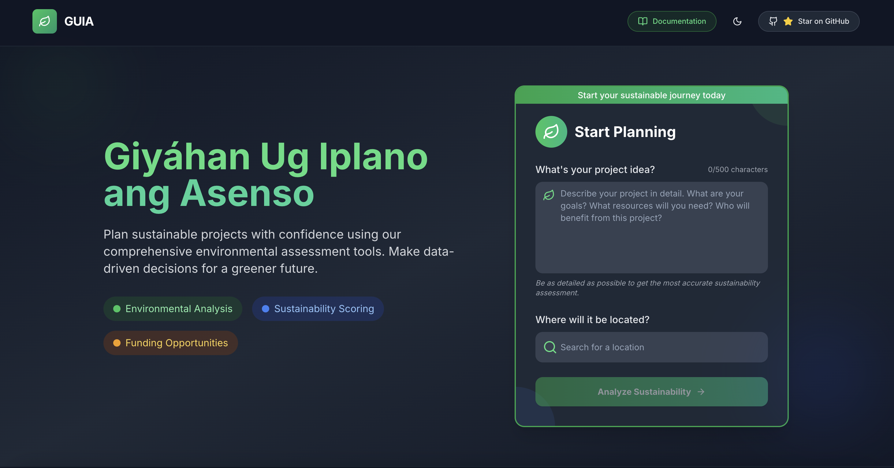

# 🌱 Folderly Guia: Sustainable Project Planning Assistant

## 🚀 Project Overview

Folderly Guia is an innovative web application designed to help urban planners, developers, and environmentalists make data-driven decisions about sustainable project planning. By analyzing geographical data, environmental factors, and sustainability metrics, our platform provides comprehensive insights to ensure projects are environmentally sound and economically viable.

## ✨ Key Features

- **Location-Based Project Analysis**: Input your project idea and location to receive tailored sustainability insights
- **Interactive Map Visualization**: Explore potential project areas with customizable radius settings
- **Comprehensive Sustainability Scoring**: Get detailed metrics on environmental impact, feasibility, and risks
- **Environmental Data Integration**: Access real-time air quality, solar potential, biodiversity, and soil data
- **Climate Risk Assessment**: Evaluate flood, earthquake, and pollution risks for your project area
- **Policy Compliance Checker**: Review alignment with local regulations and international guidelines
- **Funding Opportunity Recommendations**: Discover relevant grants and financial incentives for sustainable projects
- **PDF Report Generation**: Download comprehensive project reports for sharing and documentation
- **User-Friendly Interface**: Intuitive design with smooth animations and responsive layout

## 🛠️ Tech Stack

- **Frontend**: Next.js 14, React 18, TypeScript
- **UI Components**: Tailwind CSS, Radix UI, shadcn/ui
- **Maps & Geolocation**: Google Maps API, Google Places Autocomplete
- **Animation**: Framer Motion
- **State Management**: React Hooks (useState, useEffect)
- **Routing**: Next.js App Router
- **API Integration**: OpenAI GPT-4o for sustainability analysis
- **PDF Generation**: @react-pdf/renderer
- **External APIs**: Weather, Air Quality, Solar, Biodiversity (GBIF), Soil Data
- **Development**: ESLint, TypeScript

## 🌍 How It Works

1. **Input Project Details**: Enter your project idea and select a location using the Google Places Autocomplete
2. **Analyze Area**: Adjust the radius to define the project's scope on the interactive map
3. **Generate Analysis**: Our system collects data from multiple environmental and geographical APIs
4. **AI Processing**: GPT-4o analyzes the collected data to generate comprehensive sustainability insights
5. **Review Results**: Get detailed analysis across multiple categories:
   - Overall sustainability score with detailed breakdown
   - Feasibility report with key findings and recommendations
   - Risk analysis for climate, environmental, and geological factors
   - Policy compliance with local and international regulations
   - Available funding opportunities tailored to your project
   - GIS data visualization and location images

## 📊 Data Sources

Folderly Guia integrates data from multiple sources to provide comprehensive sustainability analysis:

- **Air Quality Data**: Real-time air pollution metrics
- **Solar Potential**: Solar radiation and energy generation potential
- **Biodiversity Information**: Species occurrence data from GBIF
- **Soil Composition**: Detailed soil type and quality analysis
- **Weather Statistics**: Climate patterns and weather risks
- **Nearby Places**: Infrastructure and amenities in the project area
- **Location Imagery**: Visual context of the project location

## 💡 Why Folderly Guia?

In an era of climate change and environmental challenges, sustainable development is no longer optional—it's essential. Folderly Guia bridges the gap between environmental science and urban planning, making sustainability data accessible and actionable for everyone from city planners to community organizers.

## 👨‍💻 Development Team

Our talented team of developers brought diverse skills and perspectives to create Folderly Guia:

- **Refino Kashi Kyle G. Estudillo** - Lead Developer and AI Specialist
- **John Elias Mojado** - Backend Developer & API Specialist
- **Chris Loui Canete** - Backend Developer & API Specialist
- **Lizter Angelo Abrau** - GIS Specialist & Map Integration
- **Wince dela Fuente** - Project Manager & Sustainability Expert

## 🏆 Hackathon Submission

This project was developed for UPCSG Sustainability Innovation Hackathon.

---

Made with 💚 for a more sustainable future

